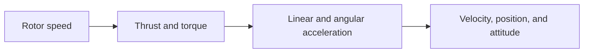

+++
title       = 'Động lực học và mô hình không gian trạng thái của quadcopter'
date        = '2026-07-22T00:00:00+07:00'
draft       = false
description = 'Động lực học, mixer và mô hình không gian trạng thái của quadcopter.'
tags        = ['Quadcopter', 'Dynamics', 'Control Systems', 'Robotics']
math        = true
mermaid     = true
+++

# Động lực học và mô hình không gian trạng thái của quadcopter

## 1. Mục tiêu của việc xây dựng mô hình

Một quadcopter chuyển động vì các rotor tạo ra lực đẩy và mô-men. Mô hình động lực học cần diễn tả đầy đủ chuỗi quan hệ

\[\text{tốc độ rotor} \rightarrow \text{lực và mô-men} \rightarrow \text{gia tốc} \rightarrow \text{vận tốc} \rightarrow \text{vị trí và tư thế}.\]

Chuỗi này được chia thành hai phần. Chuyển động tịnh tiến của khối tâm được quyết định bởi tổng hợp lực, còn chuyển động quay của thân được quyết định bởi tổng mô-men quanh khối tâm. Hai phương trình Newton-Euler nền tảng là

\[m\ddot{\mathbf r}=\mathbf F_{\mathrm{total}},\]

và

\[\mathbf I\dot{\boldsymbol\omega} +\boldsymbol\omega\times(\mathbf I\boldsymbol\omega) =\boldsymbol\tau.\]

Ở đây, $m$ là khối lượng, $\mathbf r$ là vị trí khối tâm, $\mathbf I$ là mô-men quán tính biểu diễn trong body frame, $\boldsymbol\omega$ là vận tốc góc của thân và $\boldsymbol\tau$ là tổng mô-men.

Mục tiêu cuối cùng là tổ chức các phương trình này thành mô hình không gian trạng thái để có thể mô phỏng chuyển động, xác định điểm cân bằng, tuyến tính hóa và thiết kế bộ điều khiển. Mô hình không gian trạng thái có dạng

\[\dot{\mathbf x}=f(\mathbf x,\mathbf u),\]

---

## 2. Hệ tọa độ và các đại lượng cơ bản

Ta sử dụng hai hệ tọa độ:

- Inertial frame $A$, cố định với mặt đất, dùng để biểu diễn vị trí và vận tốc tịnh tiến.
- Body frame $B$, gắn với quadcopter và có gốc tại khối tâm, dùng để biểu diễn lực đẩy, mô-men và vận tốc góc.

Vector $r$ là vị trí khối tâm trong inertial frame:

\[\mathbf r= \begin{bmatrix} x\\y\\z \end{bmatrix}\]

Vận tốc tịnh tiến là:

\[\mathbf v=\dot{\mathbf r}.\]

Vận tốc góc được biểu diễn trong body frame:

\[\boldsymbol\omega= \begin{bmatrix} p\\q\\r \end{bmatrix}.\]

Ma trận quay $R$ biến một vector từ body frame sang inertial frame. Vì lực đẩy được tạo ra theo trục $z$ của thân nhưng gia tốc tịnh tiến được viết trong inertial frame, phép biến đổi bằng $R$ là bắt buộc.

---

## 3. Lực đẩy và mô-men của rotor

### 3.1. Quan hệ với tốc độ rotor

Rotor thứ $i$ quay với tốc độ $\omega_i$ và tạo lực đẩy có độ lớn

\[F_i=k_F\omega_i^2.\]

Rotor đồng thời tạo mô-men phản lực quanh trục quay:

\[M_i=k_M\omega_i^2.\]

Lấy tỉ số hai đại lượng:

\[\frac{M_i}{F_i} = \frac{k_M\omega_i^2}{k_F\omega_i^2}.\]

Rút gọn $\omega_i^2$:

\[\frac{M_i}{F_i}=\frac{k_M}{k_F}.\]

Đặt

\[\gamma=\frac{k_M}{k_F},\]

Suy ra

\[M_i=\gamma F_i.\]

Như vậy, cùng một tốc độ rotor đồng thời quyết định lực đẩy và mô-men phản lực của rotor đó.

### 3.2. Tổng lực đẩy

Bốn lực rotor cùng phương theo trục $z$ thân. Tổng lực đẩy được định nghĩa là

\[u_1=F_1+F_2+F_3+F_4.\]

Đây là đầu vào trực tiếp của phương trình tịnh tiến.

---

## 4. Phân bổ lực cho cấu hình X

Trong cấu hình X, các trục $x$ và $y$ của body frame nằm giữa các cánh. Gọi $L$ là khoảng cách từ khối tâm đến mỗi rotor. Hình chiếu của cánh tay đòn lên mỗi trục là

\[l=L\cos 45^\circ.\]

Vì

\[\cos45^\circ=\frac{1}{\sqrt2},\]

nên

\[l=\frac{L}{\sqrt2}.\]

Với quy ước đánh số đã sử dụng trong buổi học, vị trí các rotor trong body frame là

\[\mathbf r_1= \begin{bmatrix} l\\-l\\0 \end{bmatrix}, \qquad \mathbf r_2= \begin{bmatrix} l\\l\\0 \end{bmatrix},\]

\[\mathbf r_3= \begin{bmatrix} -l\\l\\0 \end{bmatrix}, \qquad \mathbf r_4= \begin{bmatrix} -l\\-l\\0 \end{bmatrix}.\]

Lực của rotor $i$ trong body frame là

\[\mathbf F_i= \begin{bmatrix} 0\\0\\F_i \end{bmatrix}.\]

Mô-men do lực đẩy được tính từ tích có hướng:

\[\boldsymbol\tau_i=\mathbf r_i\times\mathbf F_i.\]

Với một rotor có tọa độ tổng quát

\[\mathbf r_i= \begin{bmatrix} x_i\\y_i\\0 \end{bmatrix},\]

ta có

\[\mathbf r_i\times\mathbf F_i = \begin{vmatrix} \mathbf e_x&\mathbf e_y&\mathbf e_z\\ x_i&y_i&0\\ 0&0&F_i \end{vmatrix}.\]

Khai triển định thức:

\[\mathbf r_i\times\mathbf F_i = \begin{bmatrix} y_iF_i\\-x_iF_i\\0 \end{bmatrix}.\]

Thay tọa độ của bốn rotor rồi cộng các thành phần theo trục $x$:

\[\tau_x =(-l)F_1+(l)F_2+(l)F_3+(-l)F_4,\]

suy ra

\[\tau_x=l(-F_1+F_2+F_3-F_4).\]

Tương tự, cộng các thành phần theo trục $y$:

\[\tau_y =(-l)F_1+(-l)F_2+(l)F_3+(l)F_4,\]

nên

\[\tau_y=l(-F_1-F_2+F_3+F_4).\]

Mô-men yaw đến từ mô-men phản lực của các rotor. Với hai cặp rotor quay ngược chiều nhau:

\[\tau_z=M_1-M_2+M_3-M_4.\]

Dùng $M_i=\gamma F_i$:

\[\tau_z =\gamma F_1-\gamma F_2+\gamma F_3-\gamma F_4,\]

hay

\[\tau_z=\gamma(F_1-F_2+F_3-F_4).\]

Gom tổng lực đẩy và ba mô-men vào một vector:

\[\mathbf u= \begin{bmatrix} u_1\\tau_x\\tau_y\\tau_z \end{bmatrix}.\]

Quan hệ từ lực rotor đến đầu vào động lực học là

\[\begin{bmatrix} u_1\\ \tau_x\\ \tau_y\\ \tau_z \end{bmatrix} = \begin{bmatrix} 1&1&1&1\\ -l&l&l&-l\\ -l&-l&l&l\\ \gamma&-\gamma&\gamma&-\gamma \end{bmatrix} \begin{bmatrix} F_1\\F_2\\F_3\\F_4 \end{bmatrix}.\]

Ma trận trên là **ma trận phân bổ điều khiển** hay **mixer**. Dấu của từng phần tử phụ thuộc vào quy ước đánh số rotor, chiều dương của trục và chiều quay của rotor. Khi đã xác định nhất quán các quy ước này, mixer là cầu nối giữa lệnh điều khiển tổng hợp và lực từng động cơ.

---

## 5. Phương trình Newton-Euler của quadcopter

### 5.1. Chuyển động tịnh tiến

Trọng lực trong Inertial frame là

\[\mathbf F_g=-mg\mathbf e_3, \qquad \mathbf e_3= \begin{bmatrix} 0\\0\\1 \end{bmatrix}.\]

Lực đẩy trong body frame là

\[\mathbf F_T^B=u_1\mathbf e_3.\]

Đổi lực đẩy sang Inertial frame:

\[\mathbf F_T^A=R\mathbf F_T^B.\]

Thay $\mathbf F_T^B=u_1\mathbf e_3$:

\[\mathbf F_T^A=u_1R\mathbf e_3.\]

Tổng lực ngoài là

\[\mathbf F_{\mathrm{total}} =-mg\mathbf e_3+u_1R\mathbf e_3.\]

Áp dụng định luật Newton:

\[m\ddot{\mathbf r} =-mg\mathbf e_3+u_1R\mathbf e_3.\]

Chia hai vế cho $m$:

\[\ddot{\mathbf r} =-g\mathbf e_3+\frac{u_1}{m}R\mathbf e_3.\]

Phương trình cho thấy hướng gia tốc không chỉ phụ thuộc vào độ lớn $u_1$ mà còn phụ thuộc vào tư thế thông qua $R$. Quadcopter tạo gia tốc ngang bằng cách nghiêng trục lực đẩy, không phải bằng một cơ cấu tạo lực ngang riêng.

### 5.2. Chuyển động quay

Phương trình Euler của vật rắn là

\[\mathbf I\dot{\boldsymbol\omega} +\boldsymbol\omega\times(\mathbf I\boldsymbol\omega) =\boldsymbol\tau.\]

Chuyển thành phần ghép phi tuyến sang vế phải:

\[\mathbf I\dot{\boldsymbol\omega} =\boldsymbol\tau -\boldsymbol\omega\times(\mathbf I\boldsymbol\omega).\]

Nhân hai vế với $\mathbf I^{-1}$:

\[\dot{\boldsymbol\omega} = \mathbf I^{-1} \left[ \boldsymbol\tau -\boldsymbol\omega\times(\mathbf I\boldsymbol\omega) \right].\]

Nếu các trục thân được chọn trùng với các trục quán tính chính, mô-men quán tính có dạng đường chéo:

\[\mathbf I= \begin{bmatrix} I_{xx}&0&0\\ 0&I_{yy}&0\\ 0&0&I_{zz} \end{bmatrix}.\]

Khi đó

\[\mathbf I\boldsymbol\omega = \begin{bmatrix} I_{xx}p\\I_{yy}q\\I_{zz}r \end{bmatrix}.\]

Tích có hướng được khai triển thành

\[\boldsymbol\omega\times(\mathbf I\boldsymbol\omega) = \begin{bmatrix} p\\q\\r \end{bmatrix} \times \begin{bmatrix} I_{xx}p\\I_{yy}q\\I_{zz}r \end{bmatrix}.\]

Do đó

\[\boldsymbol\omega\times(\mathbf I\boldsymbol\omega) = \begin{bmatrix} (I_{zz}-I_{yy})qr\\ (I_{xx}-I_{zz})pr\\ (I_{yy}-I_{xx})pq \end{bmatrix}.\]

Thay vào phương trình Euler:

\[I_{xx}\dot p = \tau_x-(I_{zz}-I_{yy})qr,\]

\[I_{yy}\dot q = \tau_y-(I_{xx}-I_{zz})pr,\]

\[I_{zz}\dot r = \tau_z-(I_{yy}-I_{xx})pq.\]

Sắp xếp lại:

\[\dot p = \frac{I_{yy}-I_{zz}}{I_{xx}}qr +\frac{\tau_x}{I_{xx}},\]

\[\dot q = \frac{I_{zz}-I_{xx}}{I_{yy}}pr +\frac{\tau_y}{I_{yy}},\]

\[\dot r = \frac{I_{xx}-I_{yy}}{I_{zz}}pq +\frac{\tau_z}{I_{zz}}.\]

Các tích $pq$, $pr$ và $qr$ thể hiện sự ghép nối phi tuyến giữa các chuyển động quay quanh ba trục.

---

## 6. Mô hình không gian trạng thái

### 6.1. Trạng thái là gì?

Trạng thái là tập hợp các đại lượng tại thời điểm hiện tại đủ để xác định sự thay đổi của hệ khi đầu vào đã biết. Với một hệ cơ học, chỉ biết vị trí là chưa đủ; cần biết cả vận tốc vì cùng một vị trí nhưng vận tốc khác nhau sẽ dẫn đến chuyển động tiếp theo khác nhau.

Mô hình trạng thái tổng quát là

\[\dot{\mathbf x}=f(\mathbf x,\mathbf u).\]

Trong đó, $\mathbf x$ chứa trạng thái, $\mathbf u$ chứa đầu vào và $f$ là hệ phương trình động lực học.

### 6.2. Hệ tuyến tính bất biến theo thời gian

Nếu $f$ là quan hệ tuyến tính và không phụ thuộc trực tiếp vào thời gian, mô hình có thể viết thành

\[\dot{\mathbf x}=A\mathbf x+B\mathbf u,\]

trong đó $A$ và $B$ là các ma trận hằng. Ma trận $A$ mô tả trạng thái hiện tại ảnh hưởng đến tốc độ thay đổi trạng thái, còn $B$ mô tả đầu vào tác động lên hệ.

Quadcopter có động lực học phi tuyến do ma trận quay phụ thuộc vào tư thế và do các tích vận tốc góc. Vì vậy, dạng tuyến tính thường chỉ thu được sau khi tuyến tính hóa quanh một điểm làm việc.

---

## 7. Điểm cân bằng, tuyến tính hóa và ổn định

### 7.1. Điểm cân bằng

Một cặp $(\mathbf x_e,\mathbf u_e)$ là điểm cân bằng khi trạng thái không thay đổi:

\[f(\mathbf x_e,\mathbf u_e)=\mathbf 0.\]

Đầu vào cân bằng không nhất thiết bằng không. Với quadcopter hover, rotor vẫn phải tạo lực để cân bằng trọng lực.

### 7.2. Biến sai lệch

Ta xét chuyển động gần điểm cân bằng bằng cách đặt

\[\delta\mathbf x=\mathbf x-\mathbf x_e,\]

và

\[\delta\mathbf u=\mathbf u-\mathbf u_e.\]

Mô hình phi tuyến là

\[\dot{\mathbf x}=f(\mathbf x,\mathbf u).\]

Thay

\[\mathbf x=\mathbf x_e+\delta\mathbf x, \qquad \mathbf u=\mathbf u_e+\delta\mathbf u.\]

Khai triển Taylor bậc nhất quanh $(\mathbf x_e,\mathbf u_e)$:

\[f(\mathbf x_e+\delta\mathbf x,\mathbf u_e+\delta\mathbf u) \approx f(\mathbf x_e,\mathbf u_e) + \left.\frac{\partial f}{\partial\mathbf x}\right|_e \delta\mathbf x + \left.\frac{\partial f}{\partial\mathbf u}\right|_e \delta\mathbf u.\]

Vì tại cân bằng

\[f(\mathbf x_e,\mathbf u_e)=\mathbf0,\]

nên

\[\delta\dot{\mathbf x} =A\delta\mathbf x+B\delta\mathbf u,\]

với

\[A= \left.\frac{\partial f}{\partial\mathbf x}\right|_e, \qquad B= \left.\frac{\partial f}{\partial\mathbf u}\right|_e.\]

Mô hình tuyến tính chỉ là xấp xỉ cục bộ. Khi trạng thái đi xa điểm làm việc, các thành phần bậc cao bị bỏ qua trở nên đáng kể và sai số mô hình tăng lên.

### 7.3. Ý nghĩa của ổn định

Tính ổn định mô tả phản ứng của hệ khi bị lệch nhỏ khỏi điểm cân bằng. Nếu sai lệch giảm dần và trạng thái quay về điểm cân bằng, hệ ổn định tiệm cận. Nếu sai lệch không tăng nhưng cũng không mất đi, hệ ổn định trung tính. Nếu sai lệch tăng theo thời gian, hệ không ổn định.

Với hệ tuyến tính không đầu vào

\[\delta\dot{\mathbf x}=A\delta\mathbf x,\]

hệ ổn định tiệm cận khi mọi trị riêng của $A$ đều có phần thực âm:

\[\operatorname{Re}(\lambda_i)<0.\]

---

## 8. Mô hình quadcopter phẳng

Mô hình phẳng giữ lại ba bậc tự do:

\[\mathbf q= \begin{bmatrix} y\\z\\\phi \end{bmatrix}.\]

Ở đây, $y$ là vị trí ngang, $z$ là vị trí đứng và $\phi$ là góc nghiêng trong mặt phẳng. Hai đầu vào là tổng lực đẩy $u_1$ và mô-men quay $u_2$.

### 8.1. Phân tích lực

Lực đẩy $u_1$ nằm theo trục thân. Khi thân nghiêng một góc $\phi$, các thành phần lực trong Inertial frame là

\[F_y=-u_1\sin\phi,\]

và

\[F_z=u_1\cos\phi.\]

Theo phương ngang, định luật Newton cho

\[m\ddot y=F_y.\]

Thay $F_y$:

\[m\ddot y=-u_1\sin\phi.\]

Chia cho $m$:

\[\ddot y=-\frac{u_1}{m}\sin\phi.\]

Theo phương đứng, tổng lực là lực đẩy trừ trọng lực:

\[m\ddot z=F_z-mg.\]

Thay $F_z$:

\[m\ddot z=u_1\cos\phi-mg.\]

Chia cho $m$:

\[\ddot z=-g+\frac{u_1}{m}\cos\phi.\]

Đối với chuyển động quay:

\[I_{xx}\ddot\phi=u_2.\]

Chia cho $I_{xx}$:

\[\ddot\phi=\frac{u_2}{I_{xx}}.\]

Hai phương trình tịnh tiến cho thấy vai trò của tư thế: mô-men $u_2$ làm thay đổi $\phi$, còn $\phi$ quyết định lực $u_1$ được phân bố giữa phương ngang và phương đứng như thế nào.

### 8.2. Chọn vector trạng thái

Ta chọn

\[\mathbf x= \begin{bmatrix} y\\z\\\phi\\\dot y\\\dot z\\\dot\phi \end{bmatrix}.\]

Đặt

\[x_1=y, \quad x_2=z, \quad x_3=\phi,\]

\[x_4=\dot y, \quad x_5=\dot z, \quad x_6=\dot\phi.\]

Ba phương trình động học là

\[\dot x_1=x_4,\]

\[\dot x_2=x_5,\]

\[\dot x_3=x_6.\]

Ba phương trình động lực học là

\[\dot x_4=-\frac{u_1}{m}\sin x_3,\]

\[\dot x_5=-g+\frac{u_1}{m}\cos x_3,\]

\[\dot x_6=\frac{u_2}{I_{xx}}.\]

Ghép lại:

\[\dot{\mathbf x} = \begin{bmatrix} x_4\\ x_5\\ x_6\\ -\dfrac{u_1}{m}\sin x_3\\ -g+\dfrac{u_1}{m}\cos x_3\\ \dfrac{u_2}{I_{xx}} \end{bmatrix}.\]

Đây là mô hình phi tuyến vì $\sin x_3$ và $\cos x_3$ phụ thuộc phi tuyến vào trạng thái.

### 8.3. Hover và tuyến tính hóa

Tại hover, thân nằm ngang và không có gia tốc:

\[\phi_e=0, \qquad \dot y_e=\dot z_e=\dot\phi_e=0.\]

Phương trình đứng tại cân bằng là

\[0=-g+\frac{u_{1,e}}{m}\cos0.\]

Vì $\cos0=1$:

\[0=-g+\frac{u_{1,e}}{m}.\]

Suy ra

\[u_{1,e}=mg.\]

Không có gia tốc góc nên

\[u_{2,e}=0.\]

Đặt biến sai lệch

\[\delta u_1=u_1-mg, \qquad \delta u_2=u_2,\]

và xét $\phi$ nhỏ. Khai triển Taylor của $\sin\phi$ quanh $0$:

\[\sin\phi = \sin0 + \left.\frac{d\sin\phi}{d\phi}\right|_{\phi=0}\phi + \text{các hạng bậc cao}.\]

Vì

\[\sin0=0, \qquad \left.\frac{d\sin\phi}{d\phi}\right|_{\phi=0} =\cos0=1,\]

nên

\[\sin\phi\approx\phi.\]

Tương tự:

\[\cos\phi = \cos0 + \left.\frac{d\cos\phi}{d\phi}\right|_{\phi=0}\phi + \text{các hạng bậc cao}.\]

Do

\[\cos0=1, \qquad \left.\frac{d\cos\phi}{d\phi}\right|_{\phi=0} =-\sin0=0,\]

nên

\[\cos\phi\approx1.\]

Phương trình ngang là

\[\ddot y=-\frac{u_1}{m}\sin\phi.\]

Gần hover, giữ các hạng bậc nhất và dùng $u_1\approx mg$:

\[\delta\ddot y \approx -\frac{mg}{m}\delta\phi.\]

Rút gọn:

\[\delta\ddot y\approx-g\delta\phi.\]

Phương trình đứng là

\[\ddot z=-g+\frac{u_1}{m}\cos\phi.\]

Thay

\[u_1=mg+\delta u_1,\]

và $\cos\phi\approx1$:

\[\delta\ddot z \approx -g+\frac{mg+\delta u_1}{m}.\]

Tách các hạng:

\[\delta\ddot z \approx -g+g+\frac{\delta u_1}{m}.\]

Suy ra

\[\delta\ddot z \approx \frac{\delta u_1}{m}.\]

Phương trình quay vốn đã tuyến tính theo $u_2$:

\[\delta\ddot\phi = \frac{\delta u_2}{I_{xx}}.\]

Với

\[\delta\mathbf x= \begin{bmatrix} \delta y\\ \delta z\\ \delta\phi\\ \delta\dot y\\ \delta\dot z\\ \delta\dot\phi \end{bmatrix}, \qquad \delta\mathbf u= \begin{bmatrix} \delta u_1\\ \delta u_2 \end{bmatrix},\]

mô hình tuyến tính là

\[\delta\dot{\mathbf x} =A\delta\mathbf x+B\delta\mathbf u,\]

với

\[A= \begin{bmatrix} 0&0&0&1&0&0\\ 0&0&0&0&1&0\\ 0&0&0&0&0&1\\ 0&0&-g&0&0&0\\ 0&0&0&0&0&0\\ 0&0&0&0&0&0 \end{bmatrix},\]

và

\[B= \begin{bmatrix} 0&0\\ 0&0\\ 0&0\\ 0&0\\ \dfrac{1}{m}&0\\ 0&\dfrac{1}{I_{xx}} \end{bmatrix}.\]

Mô hình này chính xác tốt gần hover. Khi góc nghiêng lớn, các xấp xỉ $\sin\phi\approx\phi$ và $\cos\phi\approx1$ không còn đủ chính xác, nên cần quay lại mô hình phi tuyến.

---

## 9. Mô hình quadcopter 3D dùng quaternion

### 9.1. Quy ước quaternion

Quaternion được viết theo dạng vô hướng trước:

\[\mathbf q= \begin{bmatrix} q_w\\q_x\\q_y\\q_z \end{bmatrix}.\]

Nó phải thỏa mãn điều kiện chuẩn đơn vị:

\[\|\mathbf q\|^2 =q_w^2+q_x^2+q_y^2+q_z^2=1.\]

Quaternion $\mathbf q$ biểu diễn phép quay từ body frame sang Inertial frame. Phần liên hợp của nó là

\[\mathbf q^*= \begin{bmatrix} q_w\\-q_x\\-q_y\\-q_z \end{bmatrix}.\]

Một vector $\mathbf a$ trong body frame được viết dưới dạng quaternion thuần ảo:

\[\mathbf a_q= \begin{bmatrix} 0\\\mathbf a \end{bmatrix}.\]

Vector tương ứng trong Inertial frame được tính bởi

\[\mathbf a_q^A =\mathbf q\otimes\mathbf a_q^B\otimes\mathbf q^*.\]

Từ phép biến đổi này, ta thu được ma trận quay $R(\mathbf q)$ sao cho

\[\mathbf a^A=R(\mathbf q)\mathbf a^B.\]

### 9.2. Vector trạng thái và đầu vào

Chọn vector trạng thái

\[\mathbf x= \begin{bmatrix} \mathbf r\\ \mathbf v\\ \mathbf q\\ \boldsymbol\omega \end{bmatrix} = \begin{bmatrix} x\\y\\z\\ v_x\\v_y\\v_z\\ q_w\\q_x\\q_y\\q_z\\ p\\q\\r \end{bmatrix}.\]

Vector này có $13$ phần tử. Tuy nhiên, do ràng buộc $\|\mathbf q\|=1$, hệ chỉ có $12$ biến độc lập.

Đầu vào động lực học là

\[\mathbf u= \begin{bmatrix} u_1\\tau_x\\tau_y\\tau_z \end{bmatrix}.\]

### 9.3. Động học tịnh tiến

Định nghĩa vận tốc cho ta

\[\dot{\mathbf r}=\mathbf v.\]

Viết theo từng thành phần:

\[\dot x=v_x, \qquad \dot y=v_y, \qquad \dot z=v_z.\]

### 9.4. Ma trận quay từ quaternion

Ma trận quay tương ứng với quaternion chuẩn đơn vị là

\[R(\mathbf q)= \begin{bmatrix} 1-2(q_y^2+q_z^2) &2(q_xq_y-q_wq_z) &2(q_xq_z+q_wq_y) \\ 2(q_xq_y+q_wq_z) &1-2(q_x^2+q_z^2) &2(q_yq_z-q_wq_x) \\ 2(q_xq_z-q_wq_y) &2(q_yq_z+q_wq_x) &1-2(q_x^2+q_y^2) \end{bmatrix}.\]

Lực đẩy trong body frame nằm theo $\mathbf e_3$, nên hướng lực đẩy trong Inertial frame chỉ cần cột thứ ba của $R$:

\[R(\mathbf q)\mathbf e_3 = R(\mathbf q) \begin{bmatrix} 0\\0\\1 \end{bmatrix}.\]

Phép nhân ma trận chọn ra cột thứ ba:

\[R(\mathbf q)\mathbf e_3 = \begin{bmatrix} 2(q_xq_z+q_wq_y)\\ 2(q_yq_z-q_wq_x)\\ 1-2(q_x^2+q_y^2) \end{bmatrix}.\]

Vector này chính là hướng trục $z$ thân khi được quan sát trong Inertial frame.

### 9.5. Động lực học tịnh tiến 3D

Lực đẩy trong body frame là

\[\mathbf F_T^B=u_1\mathbf e_3.\]

Đổi sang Inertial frame:

\[\mathbf F_T^A=R(\mathbf q)\mathbf F_T^B.\]

Thay $\mathbf F_T^B=u_1\mathbf e_3$:

\[\mathbf F_T^A=u_1R(\mathbf q)\mathbf e_3.\]

Tổng lực ngoài là

\[\mathbf F_{\mathrm{total}} =-mg\mathbf e_3 +u_1R(\mathbf q)\mathbf e_3.\]

Áp dụng định luật Newton:

\[m\dot{\mathbf v} =-mg\mathbf e_3 +u_1R(\mathbf q)\mathbf e_3.\]

Chia cho $m$:

\[\dot{\mathbf v} =-g\mathbf e_3 +\frac{u_1}{m}R(\mathbf q)\mathbf e_3.\]

Thay biểu thức của $R(\mathbf q)\mathbf e_3$:

\[\dot{\mathbf v} = \begin{bmatrix} 0\\0\\-g \end{bmatrix} + \frac{u_1}{m} \begin{bmatrix} 2(q_xq_z+q_wq_y)\\ 2(q_yq_z-q_wq_x)\\ 1-2(q_x^2+q_y^2) \end{bmatrix}.\]

Do đó

\[\dot v_x = \frac{2u_1}{m}(q_xq_z+q_wq_y),\]

\[\dot v_y = \frac{2u_1}{m}(q_yq_z-q_wq_x),\]

\[\dot v_z = -g+ \frac{u_1}{m} \left[1-2(q_x^2+q_y^2)\right].\]

### 9.6. Động học quay bằng quaternion

Vận tốc góc thân được đưa về quaternion thuần ảo:

\[\boldsymbol\omega_q= \begin{bmatrix} 0\\p\\q\\r \end{bmatrix}.\]

Trong một khoảng thời gian rất nhỏ $dt$, quay vi phân do vận tốc góc tạo ra có quaternion xấp xỉ

\[\delta\mathbf q \approx \begin{bmatrix} 1\\ \dfrac{p\,dt}{2}\\ \dfrac{q\,dt}{2}\\ \dfrac{r\,dt}{2} \end{bmatrix}.\]

Vì $\boldsymbol\omega$ được biểu diễn trong body frame, tư thế mới được cập nhật bằng phép nhân bên phải:

\[\mathbf q(t+dt) \approx \mathbf q(t)\otimes\delta\mathbf q.\]

Thay $\delta\mathbf q$:

\[\mathbf q(t+dt) \approx \mathbf q(t) + \frac{dt}{2} \mathbf q(t)\otimes\boldsymbol\omega_q.\]

Chuyển $\mathbf q(t)$ sang vế trái:

\[\mathbf q(t+dt)-\mathbf q(t) \approx \frac{dt}{2} \mathbf q(t)\otimes\boldsymbol\omega_q.\]

Chia cho $dt$:

\[\frac{\mathbf q(t+dt)-\mathbf q(t)}{dt} \approx \frac{1}{2} \mathbf q(t)\otimes\boldsymbol\omega_q.\]

Lấy giới hạn khi $dt\to0$:

\[\dot{\mathbf q} = \frac{1}{2} \mathbf q\otimes\boldsymbol\omega_q.\]

Tích quaternion giữa

\[\mathbf q= \begin{bmatrix} q_w\\q_x\\q_y\\q_z \end{bmatrix}\]

và

\[\boldsymbol\omega_q= \begin{bmatrix} 0\\p\\q\\r \end{bmatrix}\]

được khai triển thành

\[\mathbf q\otimes\boldsymbol\omega_q = \begin{bmatrix} -q_xp-q_yq-q_zr\\ q_wp-q_zq+q_yr\\ q_zp+q_wq-q_xr\\ -q_yp+q_xq+q_wr \end{bmatrix}.\]

Vì vậy

\[\dot q_w =-\frac12(q_xp+q_yq+q_zr),\]

\[\dot q_x =\frac12(q_wp-q_zq+q_yr),\]

\[\dot q_y =\frac12(q_zp+q_wq-q_xr),\]

\[\dot q_z =\frac12(-q_yp+q_xq+q_wr).\]

Dạng ma trận tương đương là

\[\dot{\mathbf q} = \frac12 \begin{bmatrix} -q_x&-q_y&-q_z\\ q_w&-q_z&q_y\\ q_z&q_w&-q_x\\ -q_y&q_x&q_w \end{bmatrix} \begin{bmatrix} p\\q\\r \end{bmatrix}.\]

Trong mô phỏng số, sai số tích phân có thể làm $\|\mathbf q\|$ lệch khỏi $1$. Vì vậy quaternion thường được chuẩn hóa sau mỗi bước:

\[\mathbf q \leftarrow \frac{\mathbf q}{\|\mathbf q\|}.\]

### 9.7. Động lực học quay 3D

Phương trình quay giữ nguyên dạng Newton-Euler:

\[\dot{\boldsymbol\omega} = \mathbf I^{-1} \left[ \boldsymbol\tau -\boldsymbol\omega\times(\mathbf I\boldsymbol\omega) \right].\]

Với mô-men quán tính đường chéo, các thành phần là

\[\dot p = \frac{I_{yy}-I_{zz}}{I_{xx}}qr + \frac{\tau_x}{I_{xx}},\]

\[\dot q = \frac{I_{zz}-I_{xx}}{I_{yy}}pr + \frac{\tau_y}{I_{yy}},\]

\[\dot r = \frac{I_{xx}-I_{yy}}{I_{zz}}pq + \frac{\tau_z}{I_{zz}}.\]

Quaternion chỉ thay đổi cách mô tả tư thế và phương trình động học quay. Phương trình mô-men và gia tốc góc của vật rắn không thay đổi.

### 9.8. Mô hình trạng thái 3D hoàn chỉnh

Gom bốn nhóm phương trình:

\[\dot{\mathbf r}=\mathbf v,\]

\[\dot{\mathbf v} =-g\mathbf e_3 +\frac{u_1}{m}R(\mathbf q)\mathbf e_3,\]

\[\dot{\mathbf q} =\frac12\mathbf q\otimes \begin{bmatrix} 0\\\boldsymbol\omega \end{bmatrix},\]

\[\dot{\boldsymbol\omega} = \mathbf I^{-1} \left[ \boldsymbol\tau -\boldsymbol\omega\times(\mathbf I\boldsymbol\omega) \right].\]

Do đó

\[\boxed{ \dot{\mathbf x} = \begin{bmatrix} \mathbf v\\[2mm] -g\mathbf e_3+\dfrac{u_1}{m}R(\mathbf q)\mathbf e_3\\[3mm] \dfrac12\mathbf q\otimes \begin{bmatrix} 0\\\boldsymbol\omega \end{bmatrix}\\[4mm] \mathbf I^{-1} \left[ \boldsymbol\tau -\boldsymbol\omega\times(\mathbf I\boldsymbol\omega) \right] \end{bmatrix} }\]

với

\[\mathbf x= \begin{bmatrix} \mathbf r\\\mathbf v\\\mathbf q\\\boldsymbol\omega \end{bmatrix}, \qquad \mathbf u= \begin{bmatrix} u_1\\\boldsymbol\tau \end{bmatrix}.\]

Đây là mô hình không gian trạng thái phi tuyến đầy đủ của quadcopter 3D dùng quaternion.

### 9.9. Điều kiện hover

Tại hover, vận tốc tịnh tiến và vận tốc góc bằng không:

\[\mathbf v_e=\mathbf0, \qquad \boldsymbol\omega_e=\mathbf0.\]

Khi thân thẳng hàng với Inertial frame, quaternion cân bằng là

\[\mathbf q_e= \begin{bmatrix} 1\\0\\0\\0 \end{bmatrix}.\]

Khi đó

\[R(\mathbf q_e)\mathbf e_3=\mathbf e_3.\]

Phương trình tịnh tiến tại cân bằng là

\[\mathbf0 =-g\mathbf e_3 +\frac{u_{1,e}}{m}\mathbf e_3.\]

So sánh hệ số theo $\mathbf e_3$:

\[0=-g+\frac{u_{1,e}}{m}.\]

Suy ra

\[u_{1,e}=mg.\]

Để không có gia tốc góc:

\[\boldsymbol\tau_e=\mathbf0.\]

Với cấu hình X đối xứng, điều kiện này tương ứng với

\[F_1=F_2=F_3=F_4=\frac{mg}{4}.\]

Đầu vào cân bằng là

\[\mathbf u_e= \begin{bmatrix} mg\\0\\0\\0 \end{bmatrix}.\]

### 9.10. Tuyến tính hóa mô hình 3D quanh điểm cân bằng

Ở trạng thái cân bằng, ta có:

\[\mathbf r_e=\text{hằng số}, \qquad \mathbf v_e=\mathbf0, \qquad \mathbf q_e= \begin{bmatrix} 1\\0\\0\\0 \end{bmatrix}, \qquad \boldsymbol\omega_e=\mathbf0, \qquad \mathbf u_e= \begin{bmatrix} mg\\0\\0\\0 \end{bmatrix}.\]

Vị trí cân bằng có thể là bất kỳ vị trí nào. Vì vậy, vị trí không xuất hiện trong các phương trình sai lệch. Ta dùng đầu vào sai lệch:

\[\delta\mathbf u= \begin{bmatrix} \delta u_1\\\delta\tau_x\\\delta\tau_y\\\delta\tau_z \end{bmatrix} = \mathbf u-\mathbf u_e.\]

Không nên dùng trực tiếp bốn thành phần quaternion làm bốn trạng thái sai lệch độc lập, vì quaternion đơn vị có ràng buộc:

\[\mathbf q^\mathsf T\mathbf q=1.\]

Thay vào đó, dùng vector góc nhỏ ba chiều:

\[\delta\boldsymbol\theta= \begin{bmatrix} \delta\phi\\\delta\theta\\\delta\psi \end{bmatrix}, \qquad \mathbf q \approx \begin{bmatrix} 1\\\dfrac12\delta\boldsymbol\theta \end{bmatrix}.\]

Ở đây, \(\delta\phi\), \(\delta\theta\), và \(\delta\psi\) là sai lệch roll, pitch, và yaw nhỏ. Vector trạng thái tuyến tính có \(12\) phần tử:

\[\delta\mathbf x= \begin{bmatrix} \delta\mathbf r\\\delta\mathbf v\\\delta\boldsymbol\theta\\\delta\boldsymbol\omega \end{bmatrix}.\]

Với góc nhỏ, hướng trục lực đẩy có xấp xỉ:

\[R(\mathbf q)\mathbf e_3 \approx \mathbf e_3+\delta\boldsymbol\theta\times\mathbf e_3 = \begin{bmatrix} \delta\theta\\-\delta\phi\\1 \end{bmatrix}.\]

Khai triển phương trình tịnh tiến và bỏ các tích của hai đại lượng sai lệch trở lên cho:

\[\delta\dot{\mathbf v}= \begin{bmatrix} g\delta\theta\\-g\delta\phi\\\dfrac{\delta u_1}{m} \end{bmatrix}.\]

Do đó, pitch dương tạo gia tốc theo \(+x\), roll dương tạo gia tốc theo \(-y\). Các dấu này đến từ quy ước lực đẩy theo \(+z\) thân và ma trận quay của phần trước.

Từ động học quaternion tại hover:

\[\delta\dot{\boldsymbol\theta}=\delta\boldsymbol\omega.\]

Trong phương trình Euler, các tích \(pq\), \(pr\), và \(qr\) đều là bậc hai quanh \(\boldsymbol\omega_e=\mathbf0\). Chúng bị bỏ đi trong mô hình bậc nhất:

\[\delta\dot{\boldsymbol\omega}=\mathbf I^{-1}\delta\boldsymbol\tau.\]

Đặt:

\[G= \begin{bmatrix} 0&g&0\\-g&0&0\\0&0&0 \end{bmatrix}.\]

Mô hình tuyến tính có dạng:

\[\delta\dot{\mathbf x}=A\delta\mathbf x+B\delta\mathbf u,\]

với:

\[A= \begin{bmatrix} \mathbf0_{3\times3}&I_3&\mathbf0_{3\times3}&\mathbf0_{3\times3}\\ \mathbf0_{3\times3}&\mathbf0_{3\times3}&G&\mathbf0_{3\times3}\\ \mathbf0_{3\times3}&\mathbf0_{3\times3}&\mathbf0_{3\times3}&I_3\\ \mathbf0_{3\times3}&\mathbf0_{3\times3}&\mathbf0_{3\times3}&\mathbf0_{3\times3} \end{bmatrix},\]

\[B= \begin{bmatrix} \mathbf0_{3\times1}&\mathbf0_{3\times3}\\ \dfrac1m\mathbf e_3&\mathbf0_{3\times3}\\ \mathbf0_{3\times1}&\mathbf0_{3\times3}\\ \mathbf0_{3\times1}&\mathbf I^{-1} \end{bmatrix}.\]

Mô hình này cho thấy cấu trúc gần hover: lực đẩy sai lệch tác động trực tiếp lên gia tốc thẳng đứng; roll và pitch tác động lên gia tốc ngang; mô-men tác động lên gia tốc góc. Yaw không tác động trực tiếp lên vị trí ở bậc nhất, nhưng mô-men yaw vẫn điều khiển vận tốc góc quanh trục \(z\).

Mô hình chỉ hợp lệ gần hover với góc và vận tốc góc nhỏ. Khi quadcopter nghiêng mạnh, quay nhanh, hoặc có lực cản khí động học đáng kể, cần dùng lại mô hình phi tuyến của Mục 9.8 hoặc tuyến tính hóa quanh điểm làm việc mới.

---

## 10. Vị trí của mô hình trong hệ thống điều khiển

Bộ lập kế hoạch quỹ đạo tạo ra vị trí, vận tốc và gia tốc mong muốn theo thời gian. Bộ điều khiển so sánh trạng thái mong muốn với trạng thái thực để tạo tổng lực đẩy và các mô-men:

\[\mathbf u= \begin{bmatrix} u_1\\tau_x\\tau_y\\tau_z \end{bmatrix}.\]

Mô hình động lực học cho biết đầu vào đó làm trạng thái thay đổi như thế nào:

\[\dot{\mathbf x}=f(\mathbf x,\mathbf u).\]

Trạng thái thực được phản hồi về bộ điều khiển, tạo thành vòng kín:

\[\text{quỹ đạo mong muốn} \longrightarrow \text{bộ điều khiển} \longrightarrow \text{quadcopter} \longrightarrow \text{trạng thái thực} \longrightarrow \text{sai số bám}.\]

Mô hình không thay thế quadcopter thật; nó cung cấp quan hệ toán học để dự đoán tác động của đầu vào, phân tích hệ và xây dựng luật điều khiển.

---

## 11. Các công thức cốt lõi cần ghi nhớ

Quan hệ rotor:

\[F_i=k_F\omega_i^2, \qquad M_i=k_M\omega_i^2, \qquad M_i=\gamma F_i.\]

Mixer cấu hình X:

\[\begin{bmatrix} u_1\\\tau_x\\\tau_y\\\tau_z \end{bmatrix} = \begin{bmatrix} 1&1&1&1\\ -l&l&l&-l\\ -l&-l&l&l\\ \gamma&-\gamma&\gamma&-\gamma \end{bmatrix} \begin{bmatrix} F_1\\F_2\\F_3\\F_4 \end{bmatrix}, \qquad l=\frac{L}{\sqrt2}.\]

Động lực học tịnh tiến 3D:

\[\dot{\mathbf r}=\mathbf v,\]

\[\dot{\mathbf v} =-g\mathbf e_3 +\frac{u_1}{m}R(\mathbf q)\mathbf e_3.\]

Động học quaternion:

\[\dot{\mathbf q} = \frac12\mathbf q\otimes \begin{bmatrix} 0\\\boldsymbol\omega \end{bmatrix}.\]

Động lực học quay:

\[\dot{\boldsymbol\omega} = \mathbf I^{-1} \left[ \boldsymbol\tau -\boldsymbol\omega\times(\mathbf I\boldsymbol\omega) \right].\]

Mô hình trạng thái tổng quát:

\[\dot{\mathbf x}=f(\mathbf x,\mathbf u).\]

Điều kiện hover:

\[u_{1,e}=mg, \qquad \boldsymbol\tau_e=\mathbf0.\]
